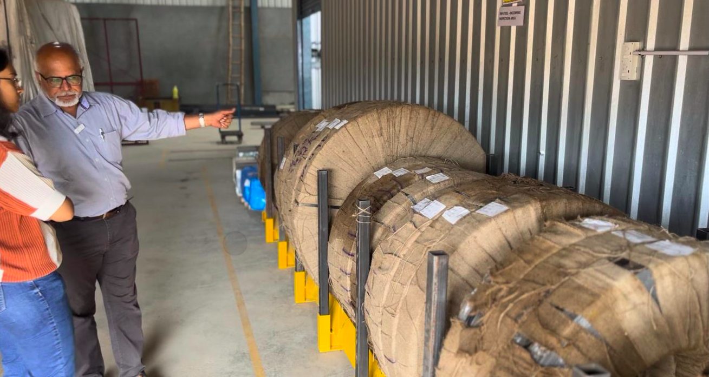
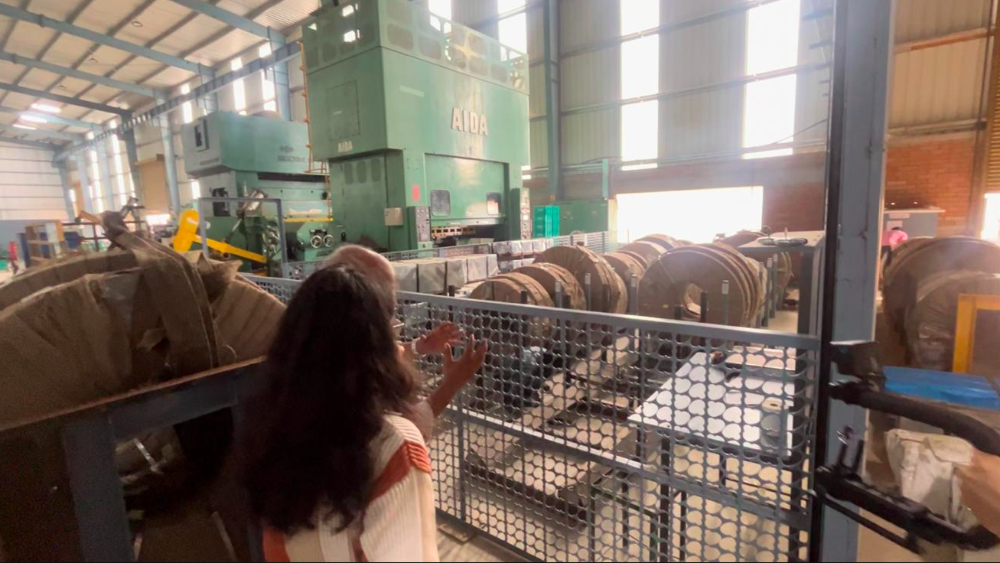
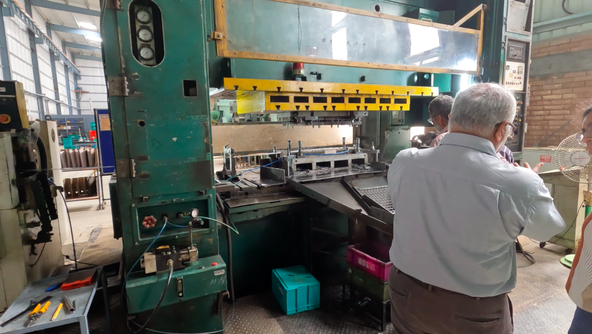
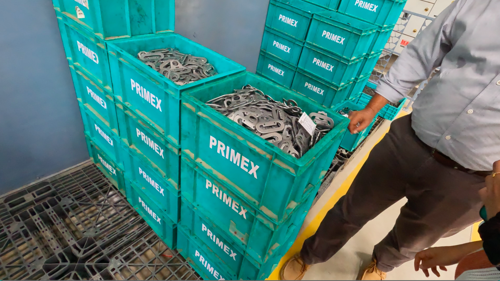
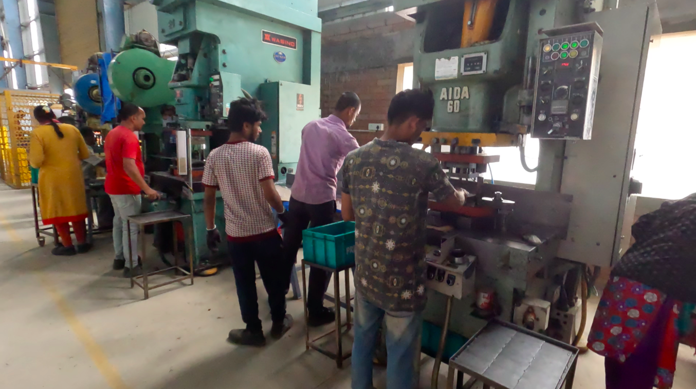
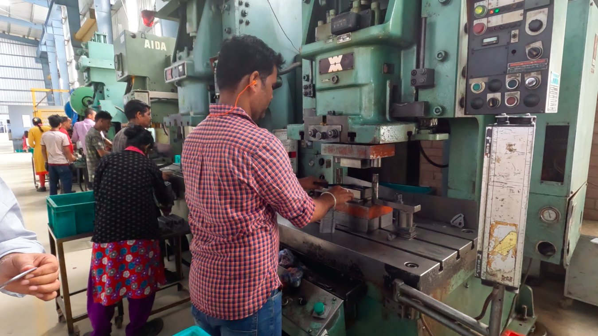
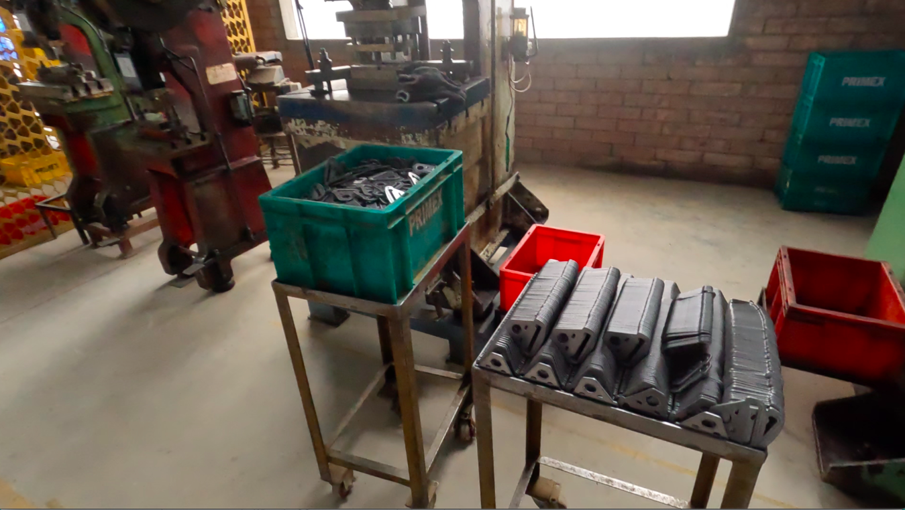
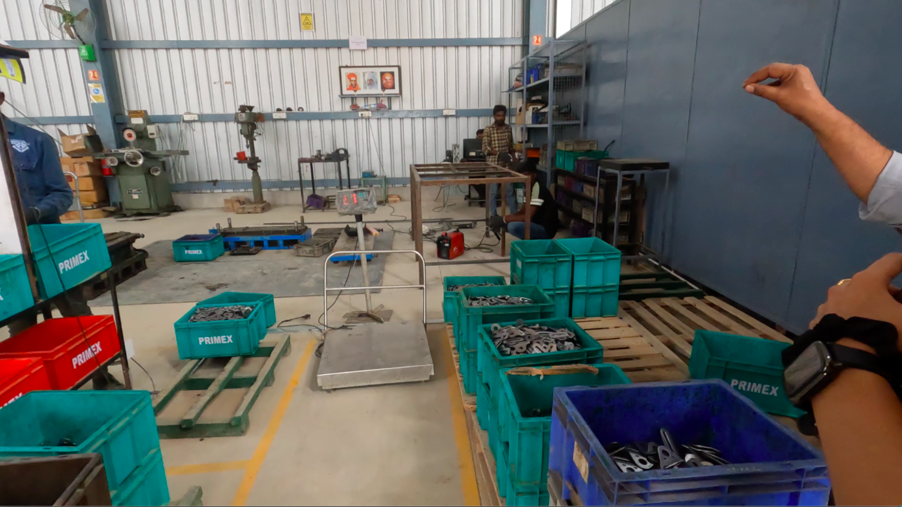
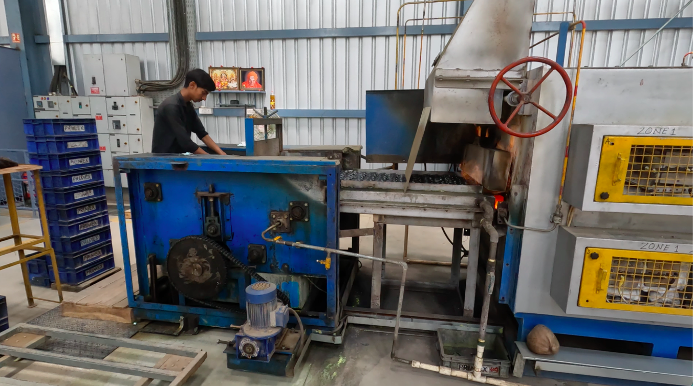
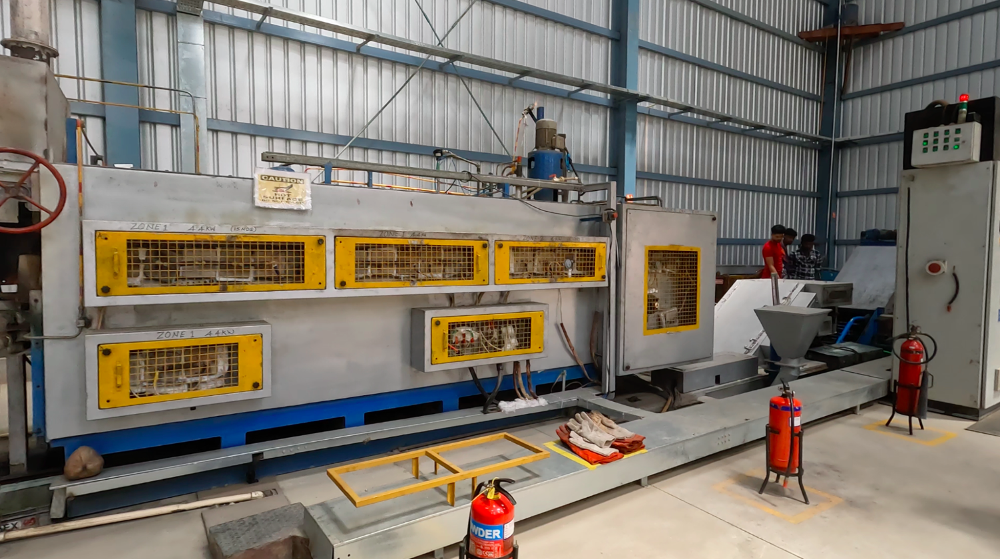

## Factory tour and overview

### Raw Materials

1. Each month, we create a Metal/Material Requirement Plan (MRP).
2. In the inspection area, a Quality Control (QC) inspector evaluates the raw materials based on our standards. If they pass, a validation tag is attached.
3. Despite any manufacturer's claims about the quality of raw materials (e.g., steel plates), we perform our own inspections.
4. If raw materials are rejected, they are returned to the supplier with evidence of the rejection, following standard procedures.
5. Accepted materials are moved to the accepted area.

### Pre-Production

1. Based on the Material Requisition Plan, materials are issued to the production line from the accepted stock.
2. Inspection procedures are conducted to check the quality before starting production.
3. Once the material is loaded, setup approval and in-process inspection are performed. The setup is checked every 30 minutes or at a specific frequency to inspect the parts.
4. When the QC team approves, production can begin.

### Production Line

1. There are eight different types of buckles produced.
2. High-volume buckles are manufactured using automated molding machines, producing 25,000 units a day.
   

3. Low-volume buckles, which don't justify high investment in automation, are made at manual workstations.
4. Low-volume items go through five stages of production, compared to just one stage for high-volume items.
   
   

5. The final step is a visual inspection and pressing, conducted in the press shop.
6. 5k per batch. Usage of batch code because if one unit is wrong whole batch is discarded and looked for fault in the whole production line till the procurement of raw material.

### Post-Production

1. Parts are sent for heat treatment after the press shop.
2. Before heat treatment, certain criteria must be checked, such as oil marks, rust marks, and distortions.
   

3. This step is crucial because the part will be committed for 15-20 years in a car.
4. Batch processes and color coding are used to organize the parts.
5. The heat treatment line is fully automated, requiring only feeding. Gas is also fed at the right temperatures.
6. Heat treatment takes between one to one and a half hours.
   
   

7. During treatment, the metal is heated and passed through salt.

### Testing the Structure

1. The harness structure undergoes quality checks to verify bainite properties, including purity, intensity, and overall quality.
2. Various certification and testing methods are conducted in the lab, approved by customers such as Toyota, Maruti, General Motors, and Snyder.
3. The facility adheres to CQ-I9 certifications and quality testing standards.

_Further processes will be covered in the next integrated plant’s tour._

## Interview Q&A

1. What does primex plastics do?

   We make injection moulded and overmoulded parts and supply to various industries like automotive industry, electrical industry, furniture divisions and also telecommunications.

2. Whats your story and how did you start in this industry?

   We’ve been professionals in different industries. we have 25+ years of experience working, and we started this sometime ago where we acquired the primex industry which has been in business for 30+ years. We enhanced the facilities and infrastructure after acquiring it.

3. Did you get into this industry because of the demand?

   This was an established industry and we got the opportunity to acquire this. it is very hard to establish one’s presence, but since this was a established business - we thought of this as lucrative thing to get into. “You know, when we start the new industry, lot of efforts are required to establish as well as getting a market. It was established industry so that it was easy for us to take to the next step”

4. Since you're very close to this automotive industry and you've been operating for 30 years now, what do you, what trends do you see shaping the automated parts industry in the next five to ten years? And what are the current challenges in your industry?

   - The automotive industry has significant growth potential, particularly when comparing India to other countries. For instance, the car usage rate in India is approximately 21 cars per thousand people, highlighting a substantial gap compared to other nations. This indicates that over the next 20-25 years, there should be robust growth in the automotive sector.

   - However, several challenges need to be addressed. Firstly, infrastructure development is crucial. Without adequate infrastructure, the industry's growth will be hampered. Secondly, the availability of resources poses a significant challenge. As a component manufacturer, we face difficulties in resource procurement. The manufacturing industry today faces several hurdles. One of the main issues is the availability of skilled manpower. Additionally, as a small-scale industry, it is very tough to sustain operations amidst rising customer demands and expectations. When I started my career in the automotive industry as a purchase manager, the expectations were different. Now, they have increased significantly.

   - Another major challenge is cost management. The automotive industry has always been highly competitive, making cost control crucial. Balancing cost-efficiency while meeting high customer expectations is a significant challenge we face today.

5. So you mentioned that you worked for Toyota. How did that experience help you with this industry?

   - I began my career with a company called Autolyve, and then I moved on to Toyota and subsequently a subsidiary of TVS. In total, I have about 25 years of experience in the automotive industry. One key lesson from my experience with large companies like Toyota is the importance of scale. Size matters significantly in this industry.
   - Working for a company as large as Toyota is entirely different from operating a small or medium-scale industry. The processes, resources, and overall approach in large organizations are on a completely different scale, which can be challenging to correlate with the operations of a smaller company. Nonetheless, the experience provided valuable insights into efficient operations, high standards, and the importance of maintaining quality and customer satisfaction, which are crucial regardless of the company's size.

6. India is changing very quickly. How do you identify and capitalize on new market opportunities?

   - India is currently a prime destination for every automaker in the world. You can find almost every car model in this country, and many automakers who are not yet present in India are eager to establish their facilities here due to the vast potential. Firstly, the car usage rate in India is significantly lower compared to other countries, indicating a huge growth opportunity. The gap in car usage per thousand people suggests a promising market expansion. Secondly, India's economy is developing rapidly, and there is a burgeoning young generation. This demographic shift is contributing to an increased demand for cars. Unlike in the past, where owning a car was considered a luxury, it has now become a necessity for many. The car market in India is poised for significant growth. As the economy continues to improve and the younger generation seeks more convenience and mobility, the demand for cars will undoubtedly rise.

7. You mentioned that there are a lot of factories manufacturing similar cars and parts in the automotive industry. How do you manage your competition here in India?

   - Competition shouldn't pose a significant problem because there is ample scope and facilities available. Once we have the capacity and the necessary facilities, we can manage effectively. The automotive industry today is governed by stringent standards such as TS 16949, mesh audits, SQ 9, and IITFE. Adhering to these standards ensures that there should be no fear for any business in this country. There is a lot of demand in the market, and new manufacturers are continuously entering and increasing their capacity. Many vehicle manufacturers are looking at India as a base for exports. Therefore, there should not be any trouble for any manufacturing industry here. At our level, we can grow sustainably by maintaining quality and delivery standards. Quality is paramount in the automotive industry. If you don't maintain quality, you won't survive in the industry. There is a significant demand, and our products are very exclusive. We have two divisions: the injection molding division and the overmolded division. Overmolding, in particular, is performed by very few companies in this country and is primarily used for seat belt applications. There is a huge demand for seat belts as every vehicle, including cars and trucks, requires them. This demand ensures that as long as we maintain quality and delivery, we can compete effectively in the market.

8. What do you think differentiates your product specifically from your competitors?

   - The injection molding process itself is quite straightforward. Today, manufacturing isn't the primary challenge; if you have the necessary facilities and resources, you can produce almost anything. What sets us apart is our approach to selling and marketing, which has become crucial in securing and fulfilling orders in a competitive market. Our company, Primax, has a significant edge due to our fully integrated facilities. We handle everything in-house, from pressing to testing and dispatching. In contrast, many of our competitors may have similar facilities but often outsource critical processes to subcontractors. This requires additional steps to inspect and manage those processes externally before dispatching the final product. At Primax, we have a seamless and integrated approach, starting from the incoming materials to the final supply to our customers. This integration ensures consistency, quality control, and efficiency, which are critical differentiators in the market.

9. How do you deal with business operational problems in the factory workspace, such as dealing with labor and managing vendors?

   - Dealing with operational problems in the factory workspace, particularly with labor and vendors, presents its own set of challenges. We have to work with people who have varying levels of education, from very low to very high. This wide range of skill levels is a common challenge in any manufacturing industry. Another major issue is the difficulty in finding workers, especially in areas like Bangalore. Nowadays, many people prefer jobs that are perceived as "smart" and less labor-intensive, where they can enjoy a more relaxed lifestyle. The younger generation often has this mindset, seeking higher pay with less demanding work. As a result, those who are satisfied with such jobs do not see the opportunity for growth in more labor-intensive roles and thus tend to avoid them. Being a small-scale industry, attracting and retaining workers can be particularly tough. However, we focus on training our employees according to our specific needs and invest in their development. This helps in retaining good people and sustaining our systems.

10. What are the biggest issues that you face day to day? The people issue, vendor issue. What do you worry about in your operation?

    - Running one small scale industry itself is a challenge today. One is manpower. Another one is the profitability of the company. Number three is cash flow. See this is a complete balance of all the resources. Only can lead the small scale industry into the success. This small scale industry is very competitive. Price is very competitive. You have to compete with the market. That is a big challenge.

11. Does marketing play a role in your business?

    - In our business, marketing plays a minimal role. We have almost permanent customers, and most of our customers are repeat customers whose requirements are well-known to us. As such, we do not have a dedicated marketing department. When it comes to finding new customers, it usually happens organically within the industry. There is a hierarchy in the supply chain with OEMs at the top and tier-one suppliers below them. For example, in our case, we supply to divisions such as seat belts, seating, and interiors. When an OEM like Toyota or Kia enters the market, they often bring their own tier-one suppliers with them. These tier-one suppliers then source components from us, the tier-two suppliers. For instance, when Toyota entered the market, they brought along a set of suppliers who would directly supply to them. We are already suppliers to Toyota’s tier-one suppliers, so they naturally source similar parts from us. This is a common practice in the industry, and it often results in new business for us without the need for active marketing. Additionally, bulky products, such as injection-molded parts, are usually sourced from suppliers located nearby to minimize transportation costs. This proximity-based sourcing is another factor that helps us secure new business. We also supply to Schneider Electric, a significant customer for our electrical components, and export to countries like Australia. When a competitor of Schneider or a similar product manufacturer looks for a supplier, they prefer to work with someone already experienced in the field, like us, who understand the requirements and standards. However, when we want to enter new markets, such as telecommunications, a small amount of targeted marketing is necessary. We handle this marketing internally to reach potential customers in the new industry.

12. Can you tell us about your import/export relations with China pre- and post-pandemic?

    - We do not have any imports from China, neither pre-pandemic nor post-pandemic. However, during the pandemic, we received some significant orders from our customers who previously sourced their parts from China. They approached us to manufacture these parts locally in India. This shift was particularly beneficial for us, as we acquired many large mould orders during and after the pandemic. Customers who had been importing components from China started sourcing them from us instead. This trend continued post-pandemic, leading to a substantial increase in our business as more components began to be sourced locally.

13. What would you say about the Indian automotive part manufacturers compared to Chinese automotive part manufacturers? How do they compare? Are we on par with them, or are they way ahead?

    - Both Indian and Chinese automotive part manufacturers have strong infrastructures, but there are notable differences. China operates on a very large scale with massive capacity. Their ability to manufacture in high volumes is significant, and their infrastructure supports this high level of production. In terms of quality, Indian manufacturers have an edge. Indian quality standards are often better than those of Chinese manufacturers. While China excels in volume and scale, Indian manufacturers are recognized for their superior quality.

14. Is it because they have adopted a lot of technology and cost efficiency into their business?

    - Yes, the extensive adoption of technology and cost efficiency has played a significant role. China's industrial evolution took place long ago, giving them a head start. The automotive industry has been established in China for several decades, whereas in India, significant growth in this sector has only been seen in the last 20-25 years. China's scale is larger, their usage is higher, and their requirements have been substantial for a long time. This has led to the establishment of extensive facilities to cater to mass production. In contrast, India is still in the process of scaling up to meet such volumes.

15. How do you think India can improve on the capacity side to meet such volumes?

    - Capacity expansion typically happens in response to demand. When there is a clear and growing requirement, businesses are compelled to invest and upgrade their facilities to meet the demand. To improve on the capacity side, India needs to continue investing in infrastructure, adopt advanced technologies, and enhance cost efficiency. As the demand for automotive parts continues to grow in India, manufacturers will naturally expand their capacities to meet this demand. Encouraging investments in technology and infrastructure, along with government support and favorable policies, will be crucial in accelerating this growth.

16. We all say that it's very good to be in India and to industrialize India right now since we are growing. So what are the unique challenges and advantages of doing business in India according to you?

    - Even when you compare with China, China has reached a certain level already. We know that we are behind, but we are sure that we will reach that level. India will not keep quiet today; there are efforts and many movements to meet that level. The gap is approximately 20 to 25 years, in my personal opinion. So for at least the next 25 years, our generation and the next generation don't need to worry. There is growth scope, and this is a very high time for anyone to invest in the industry to make their future good.

17. What can the government do to support small-scale industries?

    - The government has several schemes for the MSME sector, but they are not directly benefiting us. For example, the interest rates and proportional financial support for small-scale industries need improvement. The government needs to work a lot more to support the MSME sector effectively.

18. So you mentioned that demand drives capacity. Do you think demand is coming to India now?

    - Of course, of course. When we took over this industry in December 2017, there were 24 machines, and out of those, six were not working. We were doing about 32 crores per annum back then. Today, we have about 75 machines, ranging from 80 tons to 1300 tons, and we have crossed 100 crores in revenue. This itself is evidence that there is a growing demand. If you are able to meet customer expectations, there are many opportunities to grow in this country and in this industry. We have put in a lot of effort, working day and night. Even today, you can see us here, involved in construction and working hard. If you sit at home, nothing will happen. Hard work is a must.

19. What other industries do you think can be lucrative to get into?

    - Electrical and telecommunications industry are growing very well.

20. What advice would you like to give to the youth of India who might want to be industrious in the future?
    - The youth must change their mindset. They think that their life is all about software, but software is not everything. Please come to the core industries, work as industrialists, work as technicians, work as engineers, and sweat yourself. Make your hands dirty. Only then will you get good results. Don't sit in an air-conditioned room and waste your health. Work hard. If you work in core industries, your health will also be good. Today, unfortunately, many parents, including industrialists, don't want their kids to come into the industry because they have seen the struggles. The kids also don't want to come because they prefer comfort and often go into software or abroad. But there is a lot of satisfaction in the hardcore industry. You are creating something out of raw materials, generating employment, and making a significant impact. For instance, we have given employment to over 450 people. Many of these employees are not very educated; they know how to write, count money, and take care of their families. We also employ many people with disabilities and widows, along with more than 160 women, most of whom are uneducated. The satisfaction you get from this kind of work cannot be found in software. While software has its own benefits, the joy of creating something tangible and providing livelihoods to many is unique to manufacturing. If you want to start a factory and do something big in the manufacturing industry, you need to involve yourself in the day-to-day activities. You cannot sit in a corner and control things. You must know what is happening at every level. Work hard and smart. Smart work is as important as hard work. Explore the potential in manufacturing, and you will succeed. Unlike the software industry, where only a few reach the top, manufacturing provides sustained opportunities. Engage directly with the work, understand every aspect, and involve yourself fully to achieve success.

## Some insights from the tour

- **Quality and Volume:** India matches China in terms of quality, but China excels in volume.
  Growing Demand: There is a significant demand for manufacturing in India, with substantial growth over the past six years.
  Youth Disinterest: Young people show little interest in manufacturing and industrial careers, leading to succession issues in many facilities.
- **Specialized Trading:** Trading specialized, monopolized products within a large value chain can be a lucrative business.
- **Supplying OEMs:** Becoming suppliers to OEMs and Tier 1 suppliers is competitive but remains a viable business strategy.
  Corporate Competition: More corporate players are entering the market, making it harder for MSMEs to survive, as seen in Peenya.
- **Automation Investment:** High investment in automation often doesn't make economic sense due to cheap, readily available labor. However, this may change in the future because of labour shortage.
- **Problem with Zetwerk's Strategy:** Zetwerk protects its interests by not connecting suppliers to customers too early, complicating clear requirement plans. Primex not being happy with zetwerk.
- **Peenya's Decline:** Peenya's strong MRO supply could procure components in around 15 minutes, but now, over 70% of its manufactories have gone out of business.
- **Local Sourcing:** They don't import anything from China, preferring steel from Tata and Jindal, which matches Chinese quality. They source raw materials from Japan and Russia only due to availability issues.
- **“4M” Concept:** No deviation from manpower, material, machines, method to ensure smooth functioning of the facility.
- **Openness To New Suppliers:** If new raw material suppliers gives better cost, then quality and procurement time - factories are very open to experimenting with new suppliers. Unlike in MRO since it contradicts the 4M principle, hence has alot of strict measures in place.

**MANUFACTURING IS HARD, BUT WITH ALOT OF POTENTIAL OF GROWTH.**
